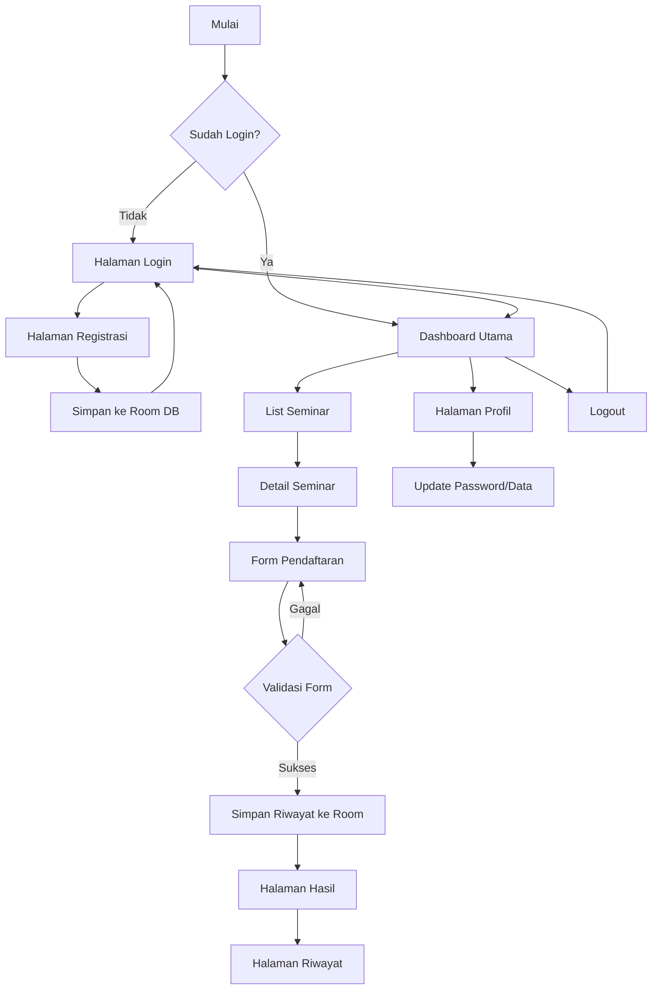
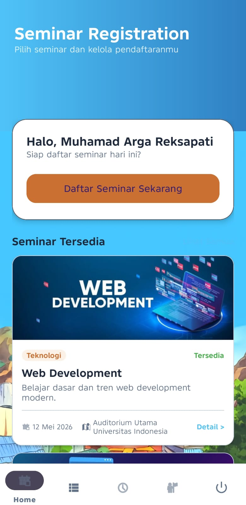
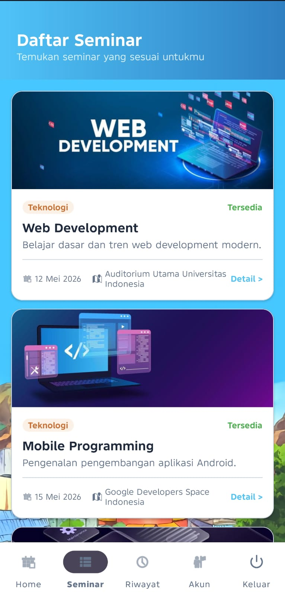
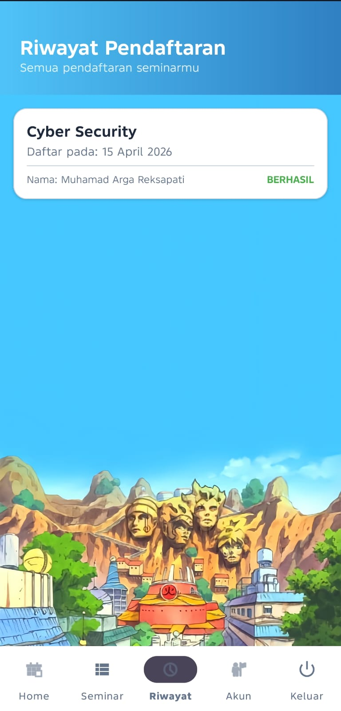
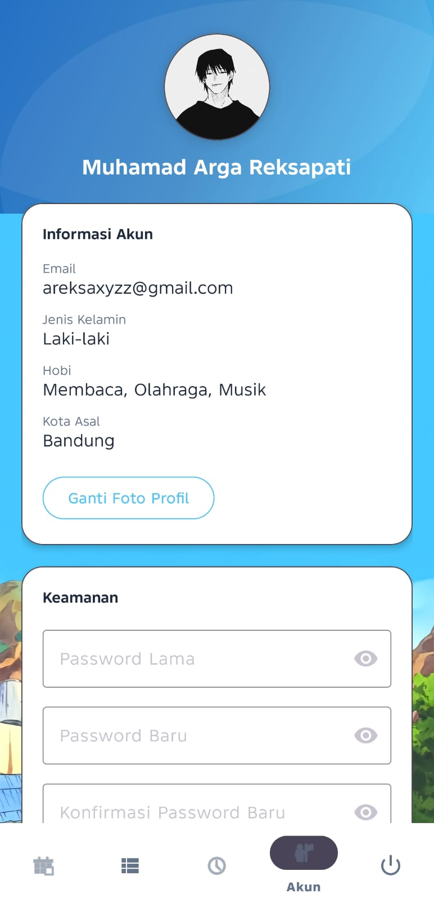
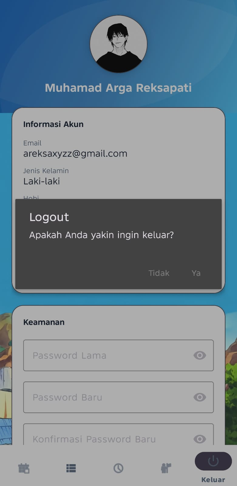

# 🎓 Seminar Registration App - Clean & Professional Anime Edition

Aplikasi pendaftaran seminar berbasis Android yang menggabungkan estetika visual **Anime Style** dengan manajemen data modern menggunakan **Room Database**.

## 🚀 Fitur Utama

*   **Sistem Registrasi & Login**: Keamanan akun dengan validasi password kompleks (8+ karakter, Huruf Kapital, & Karakter Spesial).
*   **Auto-Login (Session Manager)**: Menggunakan SharedPreferences agar user tidak perlu login berulang kali.
*   **Dashboard Dinamis**: 
    *   Greeting personal berdasarkan nama user.
    *   **Last Registration Card**: Pengingat otomatis untuk seminar terakhir yang didaftarkan.
    *   **Seminar Terpopuler**: List seminar yang diambil secara real-time dari database.
*   **Manajemen Seminar (Room DB)**: Semua data seminar dan pendaftaran dikelola secara lokal, memastikan aplikasi tetap responsif tanpa lag.
*   **Riwayat Pendaftaran**: Halaman khusus untuk melihat daftar seminar yang pernah diikuti.
*   **Validasi Real-time**: Feedback instan saat pengisian form menggunakan `TextWatcher`.
*   **UI/UX Anime Modern**: Menggunakan Material Design 3 dengan palet warna kustom dan aset visual bertema anime profesional.

---

## 📊 Alur Aplikasi (Flow Diagram)

---

## 📸 Screenshots

### 1. Registrasi & Login

  
  
   
  <i>Halaman registrasi akun baru dan login user menggunakan Room Database.</i>

### 2. Dashboard Utama

  
   
  <i>Dashboard dengan greeting personal, Last Registration card, dan list seminar terpopuler.</i>

### 3. Daftar Seminar

  
   
  <i>Menampilkan seluruh daftar seminar yang tersedia secara dinamis dari database.</i>

### 4. Riwayat Pendaftaran

  
   
  <i>Daftar histori seminar yang pernah didaftarkan oleh pengguna.</i>

### 5. Manajemen Profil & Validasi

  
   
  <i>Halaman profil untuk update data dan validasi password real-time.</i>

### 6. Dialog Konfirmasi Logout

  
   
  <i>Alert Dialog untuk mencegah user keluar aplikasi secara tidak sengaja.</i>

---

## 🛠 Tech Stack

- **Language**: [Kotlin](https://kotlinlang.org/)
- **Database**: [Room Persistence Library](https://developer.android.com/training/data-storage/room)
- **Concurrency**: [Kotlin Coroutines](https://kotlinlang.org/docs/coroutines-overview.html) & [Flow](https://kotlinlang.org/docs/flow.html)
- **Local Storage**: [SharedPreferences](https://developer.android.com/training/data-storage/shared-preferences)
- **UI Framework**: Material Design 3 (M3)
- **Image Loader**: [Glide](https://github.com/bumptech/glide)
- **Video Demo**: [Download / View on Google Drive](https://drive.google.com/file/d/1zauNOxDowmq0vb2Wp5BNGx9InKPY-b_K/view?usp=drivesdk)

---

## ⚙️ Cara Menjalankan Project

1. Clone repository ini.
2. Buka di **Android Studio (Ladybug atau versi terbaru)**.
3. Tunggu proses **Gradle Sync** selesai.
4. Jalankan pada Emulator atau Device dengan minimal **Android 8.0 (Oreo)**.
5. Pastikan melakukan **Rebuild Project** jika melakukan perubahan pada entitas Room.

---

## 📝 Catatan Pengembangan (Versi 4)
Pada pembaruan terakhir, aplikasi telah dimigrasi sepenuhnya dari data statis ke **Room Database** versi 4, menambahkan tabel `registrations` untuk mendukung fitur riwayat, serta memperbaiki navigasi bawah di 6 Activity utama.
