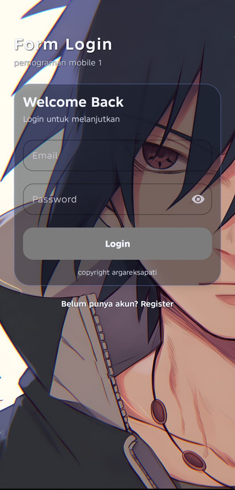
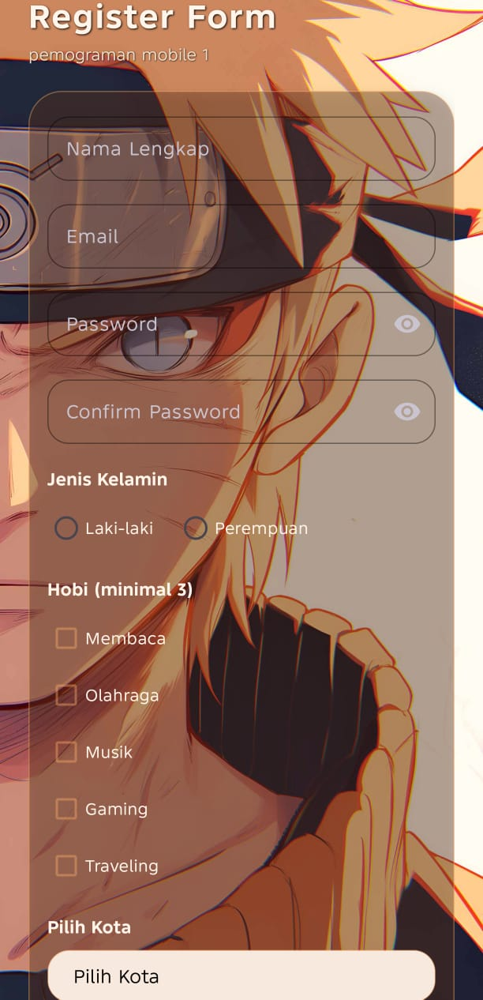

# FormAuth - Aplikasi Otentikasi Android

FormAuth adalah aplikasi Android modern yang dikembangkan menggunakan **Kotlin** dan **XML** di Android Studio. Aplikasi ini dirancang untuk memenuhi tugas pemrograman mobile dengan fokus pada validasi input yang ketat, pengalaman pengguna (UX) yang interaktif, serta estetika desain yang bersih.

---

## 🚀 Fitur Utama

### 🔐 Otentikasi & Validasi
- **Form Login & Registrasi:** Antarmuka pengguna yang responsif dengan Material Design.
- **Validasi Real-time:** Feedback instan saat pengguna mengisi email dan kata sandi.
- **Logika Validasi Ketat:**
  - Format email harus valid (mengandung `@` dan `.com`).
  - Kata sandi minimal 6 karakter.
  - Konfirmasi kata sandi harus sesuai.
- **Kontrol Pilihan:**
  - Pemilihan jenis kelamin menggunakan `RadioGroup`.
  - Pemilihan hobi menggunakan `CheckBox` (minimal harus memilih 3).
  - Pemilihan kota menggunakan `Spinner`.

### 🎨 UI & Animasi
- **Desain Modern:** Menggunakan teknik *Glassmorphism* dan kartu transparan.
- **Animasi Interaktif:**
  - Efek *Shake* (getar) pada form jika terjadi kesalahan validasi.
  - Transisi antar Activity yang halus (*Fade & Slide*).
  - Respon visual saat tombol ditekan lama (*Long Press*).
- **Dialog Konfirmasi:** `AlertDialog` muncul sebelum data dikirimkan.

---

## 🎬 Demo Video

Lihat demonstrasi penggunaan aplikasi melalui tautan ini:
[**Tonton Demo Aplikasi**](https://drive.google.com/file/d/1WGs313iSqdBIbioZw_KoaqRrRznGwl7h/view?usp=drivesdk)

---

## 🛠️ Teknologi yang Digunakan

- **Bahasa:** Kotlin
- **Layout:** XML dengan Material Components
- **Database:** Room Persistence Library (Penyimpanan data lokal)
- **Backend:** Firebase Authentication (Siap diintegrasikan)
- **Library:** Glide (Untuk pemrosesan gambar/GIF)

---

## 📸 Cuplikan Layar

| Halaman Login | Halaman Registrasi |
| :---: | :---: |
|  |  |

> *tampilan halaman login dan juga register.*

---

## 📂 Struktur Project

```text
app/
├── src/main/
│   ├── java/com/example/formtugas/
│   │   ├── data/                   # Logika Database (Room)
│   │   ├── LoginActivity.kt        # Logika Bisnis Login
│   │   └── RegisterActivity.kt     # Logika Registrasi & Validasi
│   ├── res/
│   │   ├── anim/                   # File Animasi (Shake, Fade, dll)
│   │   ├── drawable/               # Asset Gambar & Background
│   │   ├── layout/                 # Definisi UI (XML)
│   │   └── values/                 # Konfigurasi Warna & Tema
│   └── AndroidManifest.xml
├── build.gradle.kts                # Manajemen Dependensi
└── README.md
```

---

## ⚙️ Cara Menjalankan Project

1. **Clone** repositori ini ke komputer Anda.
2. Buka folder menggunakan **Android Studio** (versi Flamingo atau terbaru).
3. Tunggu hingga proses **Gradle Sync** selesai.
4. Hubungkan perangkat Android atau jalankan Emulator.
5. Klik tombol **Run** (Shift + F10).

---

## 📋 Aturan Validasi

### Registrasi
1. **Nama:** Tidak boleh kosong.
2. **Email:** Harus sesuai format email standar.
3. **Password:** Minimal 6 karakter.
4. **Hobi:** Harus memilih minimal 3 pilihan.
5. **Kota:** Harus memilih salah satu kota dari daftar.

---

## ✒️ Penulis

**Advan**  
*MUHAMAD ARGA REKSAPATI - 24552011324 - TIF RP 24C CNS*  
Tugas: PEMOGRAMAN MOBILE 1 - PERTEMUAN KE 5
