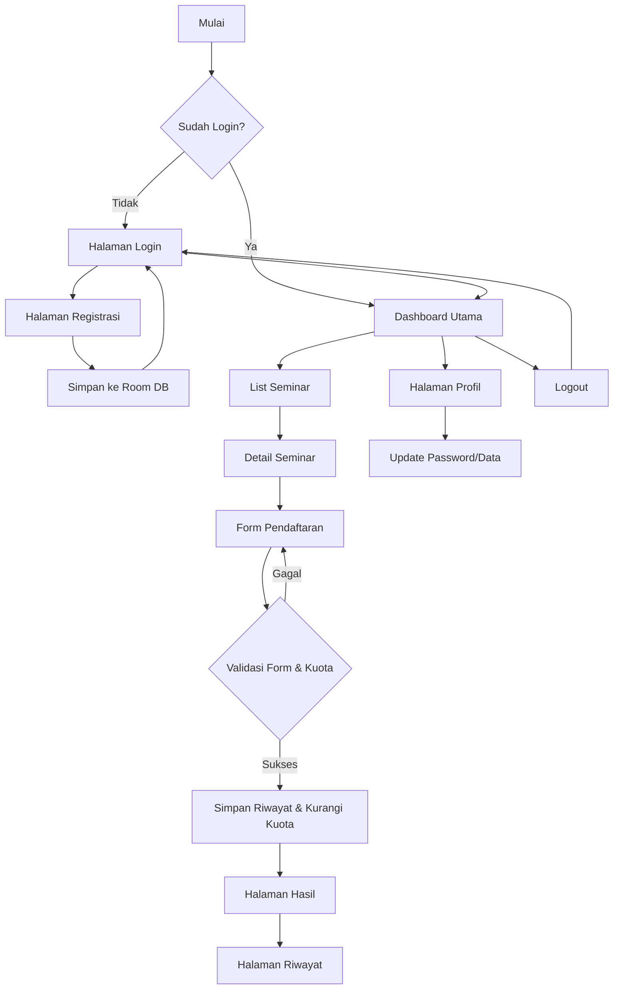

# 🎓 Seminar Registration App - Anime Edition

[](https://github.com/areksaxyz/UTS-MOBILEPROGRAMMING)

Aplikasi pendaftaran seminar berbasis Android yang menggabungkan estetika visual **Anime Style** dengan manajemen data modern menggunakan **Room Database**. Proyek ini dikembangkan sebagai tugas **UTS Mobile Programming** dengan standar profesional.

## 🌟 Fitur Utama

*   **🔐 Sistem Keamanan Akun**: Registrasi dan Login menggunakan **Room Database** dengan validasi password kompleks (8+ karakter, Huruf Kapital, & Karakter Spesial).
*   **💾 Session Persistence**: Menggunakan **SharedPreferences** untuk fitur *Auto-Login*, sehingga pengguna tidak perlu masuk berulang kali.
*   **📊 Dashboard Interaktif**: 
    *   Sapaan dinamis berdasarkan profil pengguna.
    *   **Smart Last Registration Card**: Menampilkan info seminar terakhir yang diikuti secara otomatis.
    *   **Live Seminar List**: Menampilkan seminar terpopuler yang ditarik langsung dari database.
*   **📦 Manajemen Data Room (v4)**: Arsitektur database lokal yang solid untuk menyimpan data User, Seminar (lengkap dengan sistem kuota), dan Riwayat Pendaftaran.
*   **📉 Sistem Kuota Otomatis**: Pengurangan kuota seminar secara *real-time* saat pendaftaran berhasil dan validasi stok kuota.
*   **📜 History Tracking**: Halaman khusus untuk memantau semua riwayat seminar yang pernah diikuti.
*   **🎨 UI/UX Anime Style**: Antarmuka modern menggunakan **Material Design 3**, Custom Drawables, dan palet warna profesional bertema anime.

---

## 📊 Alur Aplikasi (Flow Diagram)



---

## 📸 Dokumentasi Visual

### 1. Autentikasi User
<p align="center">
  
  
  <br>
  <i>Proses login aman dan registrasi akun baru menggunakan validasi database lokal.</i>
</p>

### 2. Dashboard Utama
<p align="center">
  
  <br>
  <i>Tampilan beranda yang dipersonalisasi dengan kartu pendaftaran terakhir dan daftar seminar unggulan.</i>
</p>

### 3. Eksplorasi Seminar
<p align="center">
  
  <br>
  <i>Daftar lengkap seminar yang tersedia, dikelola secara dinamis dari database Room.</i>
</p>

### 4. Riwayat Pendaftaran
<p align="center">
  
  <br>
  <i>Menu untuk melihat kembali jejak pendaftaran seminar yang telah sukses dilakukan.</i>
</p>

### 5. Pengaturan Profil
<p align="center">
  
  <br>
  <i>Manajemen data pribadi dan pembaruan password dengan validasi keamanan real-time.</i>
</p>

### 6. Sistem Keamanan & Logout
<p align="center">
  
  <br>
  <i>Konfirmasi keamanan sebelum keluar dari sesi aplikasi.</i>
</p>

---

## 🛠 Tech Stack

- **Core Language**: [Kotlin](https://kotlinlang.org/)
- **Local Database**: [Room Persistence Library](https://developer.android.com/training/data-storage/room)
- **Asynchronous**: [Kotlin Coroutines](https://kotlinlang.org/docs/coroutines-overview.html) & [Flow](https://kotlinlang.org/docs/flow.html)
- **Session Manager**: [SharedPreferences](https://developer.android.com/training/data-storage/shared-preferences)
- **UI Design**: Material Design 3 (M3)
- **Image Loader**: [Glide](https://github.com/bumptech/glide)
- **🎬 Video Demo**: [Tonton di Google Drive](https://drive.google.com/file/d/1zauNOxDowmq0vb2Wp5BNGx9InKPY-b_K/view?usp=drivesdk)

---

## ⚙️ Cara Instalasi & Penggunaan

1. **Clone Repository**:
   ```bash
   git clone https://github.com/areksaxyz/UTS-MOBILEPROGRAMMING.git
   ```
2. **Buka di Android Studio**: Pastikan menggunakan versi **Ladybug** atau yang lebih baru.
3. **Gradle Sync**: Tunggu hingga proses sinkronisasi library selesai.
4. **Build & Run**: Jalankan aplikasi pada perangkat fisik atau emulator dengan **SDK 26 (Android 8.0)** atau lebih tinggi.

---

## 📝 Catatan Rilis (v4.0.0-UTS)
Aplikasi ini telah melewati tahap migrasi penuh dari data statis ke **Full Room Persistence**. Pembaruan mencakup penambahan tabel riwayat, logika pengurangan kuota otomatis, serta optimasi navigasi di seluruh Activity utama untuk memastikan pengalaman pengguna yang mulus dan tanpa bug.

---
**Link Repository Utama:** [https://github.com/areksaxyz/UTS-MOBILEPROGRAMMING](https://github.com/areksaxyz/UTS-MOBILEPROGRAMMING)
